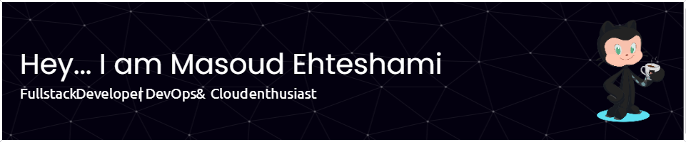

👋 Hi, I’m Masoud Ehteshami Moeini

- Software Developer
  - Web Developmnet
    - Back-End
    - Front-End
  - DevOps
  - Infrastructure
- 👀 I’m interested & working in cloud-native stacks ( Containers, Docker, K8S & Many Cloud-Native Solutions )
- 🌱 I’m currently also learning everyday!
- 💞️ I have experience in many fields from 2003-4 & also looking to collaborate on :
  - DevOps Cycle & Tools
  - Automation Solutions
  - Containers & Cloud-Native Tools & Solutions
  - Blockchain Programming
  - ML/AI Solutions , Specifically MLOps ( I'm experienced in MLOps )
  - NodeJS / Go / Dotnet & C# / Python / PHP & Laravel / Rust
  - Vue / Nuxt 
  - SQL / NoSQL / Graph Databases 
  - Microservices Architecture
  - HTML / JS / CSS / Bootstrap / Tailwind
  - WordPress / WooCommerce / Drupal

- 📫 How to reach me : https://www.linkedin.com/in/masoudehteshami/

<!---
masoudei/masoudei is a ✨ special ✨ repository because its `README.md` (this file) appears on your GitHub profile.
You can click the Preview link to take a look at your changes.
--->
