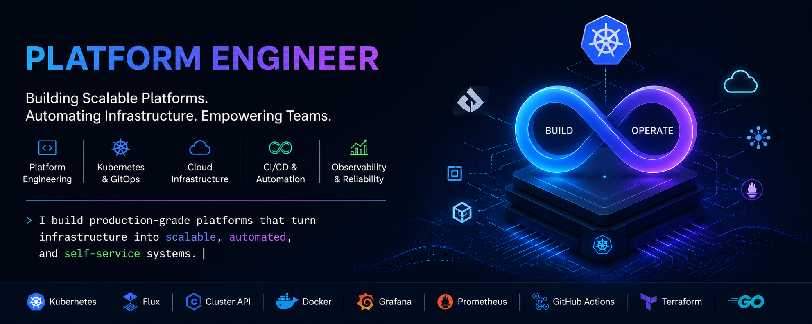

# Platform Engineer | Kubernetes | GitOps | Cloud Infrastructure

👋 Hi, I’m Masoud Ehteshami Moeini

I build production-grade platforms that transform infrastructure into scalable, automated, and self-service systems.

Over the years, I have designed and built platforms across FinTech, IoT, AI/ML, and cloud-native environments—always focused on automation, reliability, and developer experience.

## What I focus on
- Platform Engineering & Internal Developer Platforms
- Kubernetes & GitOps (Cluster API, FluxCD)
- Cloud & Infrastructure Architecture
- CI/CD & Developer Experience Optimization
- Observability & Reliability Engineering

## Selected Work

### GitOps Multi-Cluster Kubernetes Platform
- Cluster API + FluxCD + Proxmox
- Fully declarative cluster lifecycle management
- Multi-cluster, multi-tenant infrastructure

### MLOps Platform (Kubeflow)
- Kubernetes-based ML platform
- End-to-end ML pipelines with Kubeflow
- Data pipeline integration (Kafka, Airbyte, InfluxDB)

### Industrial IoT Platform
- Real-time IoT data pipeline (MQTT → InfluxDB → Grafana)
- Kubernetes-based infrastructure on Hetzner
- Hyperledger Fabric integration

### FinTech Payment Platform
- Payment gateway backend systems
- CI/CD modernization (Docker, monitoring, DB automation)
- Production reliability improvements

---

I enjoy building systems that allow engineering teams to focus on product, not infrastructure.

- 📫 How to reach me : https://www.linkedin.com/in/masoudehteshami/

<!---
masoudei/masoudei is a ✨ special ✨ repository because its `README.md` (this file) appears on your GitHub profile.
You can click the Preview link to take a look at your changes.
--->
